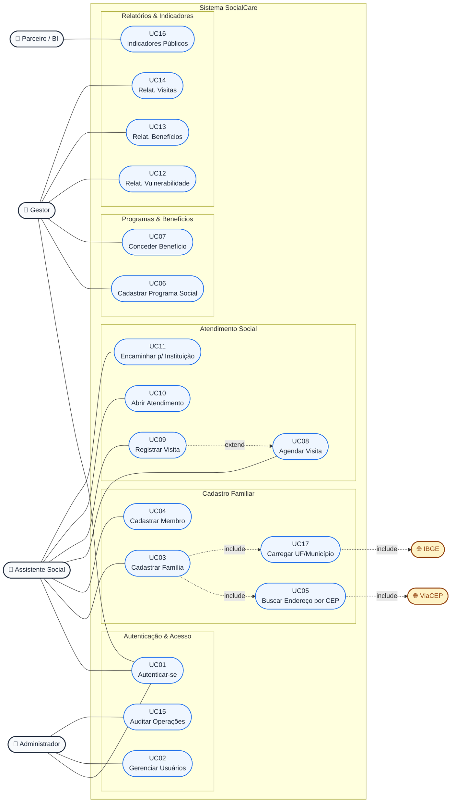

# SocialCare — Diagrama de Casos de Uso

> Fonte canônica: [`casos-de-uso.puml`](./casos-de-uso.puml) (PlantUML).
> Esta versão Mermaid renderiza diretamente no GitHub.

## Atores

| Ator | Tipo | Descrição |
|---|---|---|
| **Administrador** | primário | Gerencia usuários, audita logs. |
| **Gestor** | primário | Programas, benefícios e relatórios. |
| **Assistente Social** | primário | Famílias, membros, visitas, atendimentos, encaminhamentos. |
| **Parceiro / BI** | externo | Consome indicadores públicos via API. |
| **ViaCEP** | sistema externo | Autopreenchimento de endereço por CEP. |
| **IBGE** | sistema externo | Catálogo de UFs e Municípios. |

## Casos de uso

| ID | Caso de Uso | Atores |
|---|---|---|
| UC01 | Autenticar-se | Admin, Gestor, Assist. Social |
| UC02 | Gerenciar Usuários | Admin |
| UC03 | Cadastrar Família | Assist. Social |
| UC04 | Cadastrar Membro | Assist. Social |
| UC05 | Buscar Endereço por CEP *(«include» ViaCEP)* | Assist. Social |
| UC06 | Cadastrar Programa Social | Gestor |
| UC07 | Conceder Benefício | Gestor |
| UC08 | Agendar Visita | Assist. Social |
| UC09 | Registrar Visita *(«extend» UC08)* | Assist. Social |
| UC10 | Abrir Atendimento | Assist. Social |
| UC11 | Encaminhar para Instituição Parceira | Assist. Social |
| UC12 | Relatório: Famílias por Vulnerabilidade | Gestor |
| UC13 | Relatório: Benefícios por Programa | Gestor |
| UC14 | Relatório: Visitas por Assistente | Gestor |
| UC15 | Auditar Operações | Admin |
| UC16 | Consultar Indicadores Públicos | Parceiro/BI |
| UC17 | Carregar UF/Município *(«include» IBGE)* | Sistema |

## Diagrama (Mermaid)



## Como exportar como imagem

### Opção A — PlantUML online (recomendado para o PDF da entrega)

1. Abra <https://www.plantuml.com/plantuml/uml/>
2. Cole o conteúdo de [`casos-de-uso.puml`](./casos-de-uso.puml).
3. Baixe como **PNG** ou **SVG**.

### Opção B — VS Code

Instale a extensão **PlantUML** (`jebbs.plantuml`), abra o `.puml` e use
`Alt+D` para preview / `Ctrl+Shift+P → PlantUML: Export Current Diagram`.

### Opção C — Linha de comando

```powershell
java -jar plantuml.jar docs\casos-de-uso.puml -tpng
```
